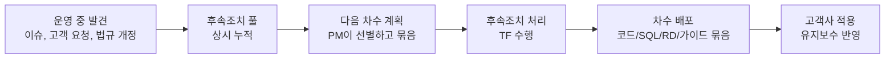
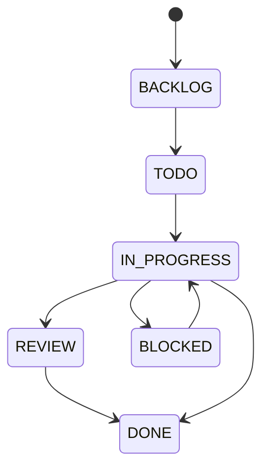
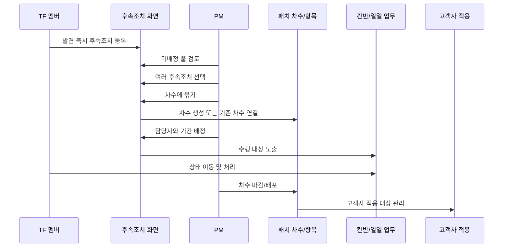

# YESS User Flow

작성일: 2026-04-29

이 문서는 YESS의 핵심 사용자 흐름을 정리한다. 기준은 현재 프로젝트 구조와 정정된 업무 모델이다.

핵심 정정:

> 후속조치가 먼저 상시 누적되고, PM이 필요한 항목을 선별해서 패치 차수로 묶은 뒤 배포한다.

즉, `후속조치 = 인풋 풀`, `패치 차수 = 묶어서 배포되는 아웃풋`이다.

## 프로젝트 기준

현재 앱은 Next.js App Router 기반 v0 화면이며, 주요 화면은 `app/(app)` 아래에 있다.

| 화면 | 라우트 | 사용자 관점 역할 |
| --- | --- | --- |
| 대시보드 | `/dashboard` | TF/유지보수 관점 요약, 지연 위험, 진척률 확인 |
| 후속조치 | `/followups` | 운영 중 발견된 모든 후속 작업의 원천 풀 |
| 패치 차수/항목 | `/rounds` | 후속조치 풀에서 골라 묶은 배포 카탈로그 |
| 일일 업무 | `/daily` | TF가 오늘 해야 할 일을 시간 축으로 보는 화면 |
| 칸반 | `/kanban` | TF가 작업 상태를 TODO, IN_PROGRESS, REVIEW, DONE 등으로 관리하는 화면 |
| 고객사 패치 현황 | `/targets` | 배포 후 고객사별 적용 상태를 유지보수 담당자가 관리하는 화면 |
| 리포트 | `/reports` | 차수별, 담당자별 진행 분석 |

현재 mock 데이터 기준 핵심 엔티티는 다음과 같다.

| 엔티티 | 현재 코드상 위치 | 의미 |
| --- | --- | --- |
| `WorkItem` | `lib/yess/data.ts`, `features/yess/types.ts` | TF 업무 단위. `FOLLOW_UP`, `BUGFIX`, `SERVICE_DESK` 등을 포함 |
| `WorkItem.type = FOLLOW_UP` | `WORK_ITEMS` | 후속조치 풀의 항목 |
| `WorkItem.round` 또는 `patchRoundId` | `WORK_ITEMS`, `WorkItem` 타입 | 특정 차수에 묶였는지 나타내는 연결값 |
| `Round` / `PatchRound` | `ROUNDS`, `PatchRound` 타입 | 배포 차수 |
| `PatchItem` | `PATCH_ITEMS`, `PatchItem` 타입 | 차수 안에 포함되는 배포 항목 |
| `DailyTask` | `DAILY_TASKS` | 날짜/시간 축에 배치된 업무 표시 단위 |
| `Company` / `PatchTarget` | `COMPANIES`, `PatchTarget` 타입 | 배포 후 고객사별 적용 대상과 적용 상태 |

## 멘탈 모델



업무는 차수에서 시작하지 않는다. 운영 중 발견된 항목이 후속조치 풀에 먼저 들어오고, PM이 그 풀을 비우면서 우선순위, 카테고리, 차수 후보 여부를 정한다. 이후 월 1~2회 차수 계획 시점에 여러 후속조치를 선택해 하나의 차수로 묶는다.

## 역할별 책임

| 역할 | 책임 |
| --- | --- |
| PM | 후속조치 인박스 검토, 우선순위 보정, 차수 묶기, 담당자/기간 배정, 차수 마감 |
| TF 멤버 | 발견 즉시 후속조치 등록, 배정된 작업 수행, 칸반 상태 갱신, 일일 업무 확인 |
| 유지보수 담당자 | 배포된 차수를 고객사에 적용하고 `/targets`에서 적용 상태와 이슈를 갱신 |

PM은 분류와 배정의 책임자다. TF는 발견 즉시 가볍게 등록하는 데 집중한다.

## 전체 사용자 플로우

| 단계 | 누가 | 화면 | 액션 | 결과 |
| --- | --- | --- | --- | --- |
| 1. 발견 | TF 또는 PM | `/followups` | 후속조치 등록 | 담당자, 기간, 차수가 비어 있는 풀 항목 생성 |
| 2. 인박스 비우기 | PM | `/followups` | 미배정/최근 등록 필터로 검토 | 우선순위, 카테고리, 보류/차수 후보 보정 |
| 3. 차수 묶기 | PM | `/followups` | 여러 후속조치 선택 후 차수에 묶기 | 선택 항목의 `round` 또는 `patchRoundId` 연결 |
| 4. 배정 | PM | `/followups` | 차수 필터 후 담당자와 기간 지정 | TF의 일일 업무와 칸반에 수행 대상 노출 |
| 5. 수행 | TF | `/daily`, `/kanban` | 오늘 업무 확인, 상태 이동 | 대시보드와 진행률에 반영 |
| 6. 배포 | PM | `/rounds` | 차수/항목 마감 및 배포 | 배포 카탈로그 확정 |
| 7. 적용 | 유지보수 | `/targets` | 고객사별 적용 상태 갱신 | 적용 완료, 실패, 보류, 이슈 추적 |

## PM 플로우

### 매일 아침: 인박스 비우기

진입 화면: `/followups`

권장 필터:

- `차수 = 미배정`
- `최근 7일 등록`

PM이 하는 일:

1. 새로 등록된 후속조치를 읽는다.
2. 우선순위와 카테고리를 보정한다.
3. 다음 차수에 들어갈 항목은 `차수 후보`로 본다.
4. 너무 작거나 지금 처리하지 않을 항목은 `보류`로 둔다.
5. 담당자와 기간은 바로 확정하지 않아도 된다. 차수 계획 또는 주간 배정 시점에 지정할 수 있다.

결과:

- 후속조치 풀은 계속 쌓이지만, PM의 검토를 통해 다음 액션이 분명해진다.
- `차수 미배정` 상태는 아직 배포 아웃풋에 묶이지 않은 인풋 상태를 의미한다.

### 월 1~2회: 차수 계획

진입 화면: `/followups`

핵심 액션:

1. 후보 후속조치를 여러 건 선택한다.
2. `차수에 묶기`를 실행한다.
3. 기존 차수 또는 새 차수를 선택한다.
4. 확정하면 선택된 후속조치가 같은 차수에 연결된다.

예시:

```text
W-225 외국인 식별번호 케이스 검증
W-226 5.2 환경 RD 출력 인코딩 점검
W-227 원천세 W01 신고서식 추가

선택한 3건을 새 차수 2026-D03에 묶기
```

결과:

- `W-225`, `W-226`, `W-227`의 차수 값이 `2026-D03`으로 설정된다.
- `/rounds`에는 `2026-D03` 차수가 배포 카탈로그로 나타난다.
- 차수는 후속조치보다 먼저 생기는 컨테이너가 아니라, 후속조치를 묶은 결과물이다.

### 차수 진행 중: 담당자와 기간 배정

진입 화면: `/followups`

권장 필터:

- `차수 = 2026-D03`

PM이 하는 일:

1. 이번 주 시작할 항목만 우선 배정한다.
2. 담당자와 기간을 지정한다.
3. 다음 주 작업은 다음 주 월요일에 다시 배정한다.

결과:

- 배정된 항목은 TF 멤버의 `/daily`에 오늘/이번 주 작업으로 보인다.
- 같은 항목은 `/kanban`에서도 상태 축 카드로 보인다.

### 매일 오전: 모니터링

진입 화면: `/dashboard`

PM이 확인하는 것:

- 차수별 진척률
- 담당자별 업무량
- 지연 위험
- `BLOCKED`, `FAILED`, `HOLD` 항목
- 오늘 마감 또는 이번 주 마감 항목

결과:

- 막힌 항목은 슬랙 콜 또는 담당자 확인으로 풀어준다.
- 차수 범위 변경이 필요하면 다시 `/followups`에서 항목을 보정한다.

## TF 멤버 플로우

### 출근 후: 오늘 업무 확인

진입 화면: `/daily`

TF 멤버가 보는 것:

- 회의 일정
- PM이 기간 배정한 후속조치
- 서비스데스크 즉응 업무
- 일반 작업 또는 리뷰 업무

예시:

```text
09:30 데일리 스탠드업
14:00 후속조치 W-225 외국인 식별번호 케이스 검증
```

결과:

- 본인이 과거에 등록한 후속조치라도 PM이 차수와 기간을 배정한 시점부터 `내 일`로 보인다.

### 작업 수행: 칸반 상태 이동

진입 화면: `/kanban`

상태 흐름:



TF 멤버가 하는 일:

1. 배정된 카드를 `TODO`에서 `IN_PROGRESS`로 이동한다.
2. 검토가 필요하면 `REVIEW`로 이동한다.
3. 막히면 `BLOCKED`로 이동하고 사유를 공유한다.
4. 완료되면 `DONE`으로 이동한다.

결과:

- `/daily`와 `/dashboard`의 진척 표시가 같은 업무 상태를 기준으로 맞춰져야 한다.

### 운영 중 새 이슈 발견

진입 화면: `/followups`

TF 멤버가 하는 일:

1. `+ 후속조치 추가` 또는 퀵 추가 입력칸을 연다.
2. 제목과 우선순위 정도만 입력한다.
3. 담당자, 기간, 차수는 비워둔다.
4. 저장한다.

예시:

```text
제목: 베타네트웍스 V4 환경 회귀 테스트 누락 케이스
우선순위: P2
담당자: 미정
기간: 미정
차수: 미정
```

결과:

- 항목은 후속조치 풀에 들어간다.
- PM이 다음 인박스 비우기 시점에 검토한다.

### 서비스데스크 즉응

진입 화면: `/kanban` 또는 `/daily`

서비스데스크 업무는 별도 규칙을 가진다.

- 타입은 `SERVICE_DESK`다.
- 차수에 묶지 않는다.
- 당일 대응 후 `DONE`으로 닫는다.
- 장기 과제가 되면 별도의 `FOLLOW_UP`으로 다시 등록한다.

## 유지보수 플로우

### 배포 후 고객사 적용

진입 화면: `/targets`

유지보수 담당자가 하는 일:

1. 차수 필터를 선택한다.
2. 본인 담당 고객사를 확인한다.
3. 적용 예정일, 적용일, 적용 상태를 갱신한다.
4. 실패나 보류 사유를 이슈 필드에 기록한다.

적용 상태:

```text
NOT_STARTED -> SCHEDULED -> IN_PROGRESS -> APPLIED
                              |
                              +-> FAILED
                              +-> HOLD
```

결과:

- PM은 `/dashboard`와 `/reports`에서 고객사 적용 상태를 확인한다.
- 실패/보류 고객사는 후속조치 풀로 다시 들어갈 수 있다.

## 화면별 상세 역할

### 후속조치 `/followups`

가장 중요한 원천 화면이다.

필수 기능:

- 차수 필터: 전체, 미배정, 특정 차수
- 빠른 등록: 제목, 우선순위 중심의 가벼운 입력
- 다중 선택: 여러 후속조치를 한 번에 차수에 묶기
- PM 보정: 우선순위, 담당자, 기간, 보류 여부

후속조치 행의 핵심 필드:

| 필드 | 의미 |
| --- | --- |
| ID | `W-225` 같은 업무 식별자 |
| 제목 | 발견된 문제나 해야 할 일 |
| 차수 | 미배정 또는 `2026-D03` 같은 배포 차수 |
| 담당자 | 비어 있으면 아직 수행자가 확정되지 않음 |
| 우선순위 | `P0`에서 `P3` |
| 상태 | `BACKLOG`, `TODO`, `IN_PROGRESS`, `BLOCKED`, `REVIEW`, `DONE` |
| 마감일 | PM이 배정한 수행 기준일 |

### 패치 차수/항목 `/rounds`

후속조치 풀에서 선별된 배포 카탈로그다.

사용 목적:

- 차수 목록 확인
- 차수 생성
- 차수 안의 패치 항목 확인
- 파일, SQL, RD, 가이드 등 배포 산출물 확인
- 차수 마감 또는 배포 상태 관리

중요한 UX 원칙:

- 차수는 업무 발견의 출발점이 아니다.
- 차수는 PM이 후속조치를 묶어 만든 배포 단위다.

### 일일 업무 `/daily`

TF의 시간 축 화면이다.

사용 목적:

- 오늘 할 일 확인
- 회의, 후속조치, 서비스데스크, 리뷰를 하루 시간표로 확인
- 후속조치 상세에서 `/followups`로 이동
- 칸반 카드와 같은 WorkItem을 다른 축으로 보여주기

### 칸반 `/kanban`

TF의 상태 축 화면이다.

사용 목적:

- 작업 상태 이동
- 담당자와 우선순위 확인
- 차수별 진행 중 업무 확인
- `BUGFIX` 또는 `SERVICE_DESK`에서 `/daily` 상세로 이동

### 대시보드 `/dashboard`

요약 화면이다.

사용 목적:

- 오늘 마감, 진행 중 업무, 신규 후속조치, 차수 진척률 확인
- TF 관점과 유지보수 관점 전환
- PM의 매일 오전 모니터링 출발점

### 고객사 패치 현황 `/targets`

배포 이후 적용 관리 화면이다.

사용 목적:

- 고객사별 적용 상태 관리
- 유지보수 담당자별 작업 확인
- 적용 실패, 보류, 지연 사유 추적
- 고객사 환경 정보와 연락처 확인

## 구현 기준 플로우

후속조치와 차수 묶기 구현 시 데이터 변경은 다음 순서로 일어나야 한다.



## 주요 예외 규칙

- `SERVICE_DESK`는 기본적으로 차수에 묶지 않는다.
- `SERVICE_DESK`가 장기 과제로 바뀌면 새 `FOLLOW_UP`을 만든다.
- 담당자, 기간, 차수가 비어 있는 `FOLLOW_UP`은 정상적인 풀 상태다.
- `DONE`이 아닌 항목을 차수에서 제거할 경우, 제거 사유가 남아야 한다.
- 이미 배포된 차수에 새 후속조치를 추가할 때는 재배포 또는 별도 차수 여부를 PM이 결정해야 한다.
- 고객사 적용 실패가 제품 수정으로 이어지면 `/targets`의 이슈에서 `/followups`로 다시 유입된다.

## 현재 화면과의 차이

현재 코드 기준 `/followups`는 후속조치 테이블 중심 화면이다. 정정된 플로우를 완전히 지원하려면 다음 세 기능이 핵심 보강점이다.

| 보강점 | 이유 |
| --- | --- |
| 다중 선택 후 차수 묶기 | PM이 풀에서 여러 항목을 한 번에 배포 단위로 만들 수 있어야 함 |
| 차수 필터 토글 | `미배정`, `2026-D03` 같은 작업 맥락 전환이 PM 업무의 중심임 |
| 퀵 추가 입력칸 | TF가 운영 중 발견한 일을 부담 없이 풀에 던질 수 있어야 함 |

이 세 기능이 들어가면 YESS의 중심 흐름은 다음처럼 정렬된다.

```text
발견 -> 후속조치 풀 -> PM 선별 -> 차수 묶기 -> TF 수행 -> 차수 배포 -> 고객사 적용
```

## QA 체크리스트

후속조치 중심 플로우가 맞게 구현되었는지 확인할 때는 아래를 본다.

- 새 후속조치를 등록하면 기본적으로 담당자, 기간, 차수가 비어 있는 풀 항목으로 남는가?
- `차수 = 미배정` 필터에서 새 항목을 찾을 수 있는가?
- 여러 후속조치를 선택해 기존 차수에 한 번에 연결할 수 있는가?
- 여러 후속조치를 선택해 새 차수를 만들고 동시에 연결할 수 있는가?
- 차수에 묶인 항목이 `/rounds`의 해당 차수 맥락과 연결되는가?
- 담당자와 기간을 지정하면 `/daily`에서 TF 멤버의 할 일로 보이는가?
- 칸반에서 상태를 바꾸면 같은 WorkItem의 상태가 일관되게 보이는가?
- `SERVICE_DESK` 타입은 차수에 묶이지 않고 당일 처리 후 종료되는가?
- 배포 후 고객사 적용 상태는 `/targets`에서 별도로 관리되는가?
